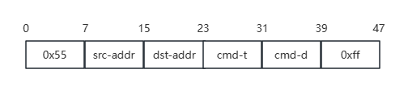
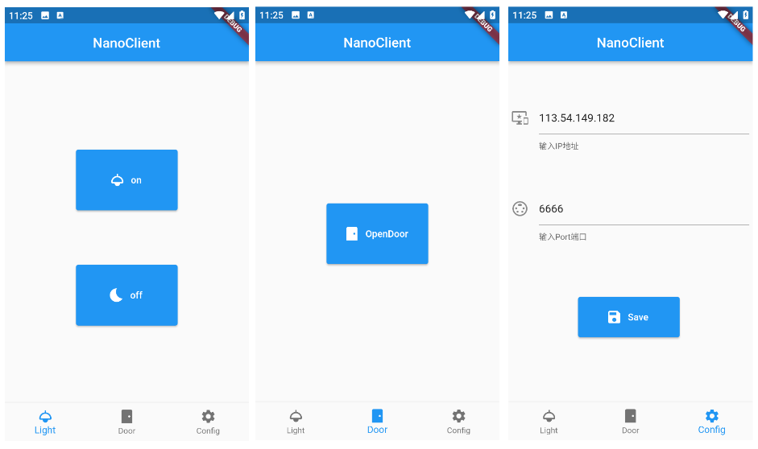

# NanoClient

Network connection of the device

## protocol

### frame format

- 0x55 :  frame start flag
- src-addr :   sender's address
- dst-addr: receiver's address
- cmd-t : command type
- cmd-d: command data
- 0xff:  frame end flag

### device address

- cell phone :  0b000xxxxx
- wifi switch :  0b001xxxxx
- ble  door    :  0b010xxxxx

### cmd-t & cmd-d

0b00000000 type is retained

- switch control type :  0b00000001
  - turn on  code :  0b00000001
  - turn off  code :  0b00000000
- door control type    :  0b00000010
  - open code :  0b00000001

## result

